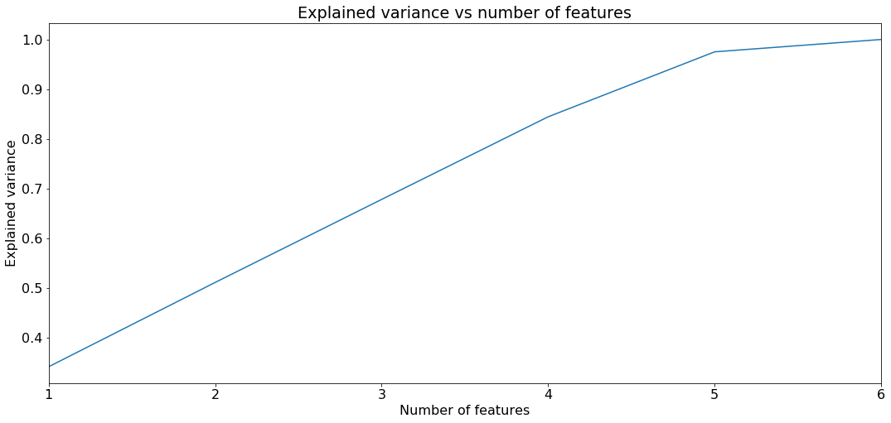

# Credit Card Analysis and Fraud Detection - Jordi Bayer
### (Ironhack Data Analytics Full Time)

## Overview

Electronic payments are growing so fast 11% from 2016 to 2017. There's a forecast that this market will grow at +9% yearly so it's an important field to be looking. 

So I'm really worried about the electronic payments field and I want to create an algorithm to predict if a transaction is a fraud or not. 

I'm going to focus on the credit card fraud (but I think that replicate the process in mobile payment would be something similar).

I want to be able to build a model that's able to classify correctly (True positives and true negatives in the confusion matrix) the 95% of the sample.

## Data Preparation

I found this [public dataset in Kaggle](https://www.kaggle.com/ananta/credit-card-data "Credit Card Data from Kaggle") uploaded by Anant Prakash Awasthi. The dataset's a dummy Credit Card Database with 4 tables (need to define the type of each variable):

  * **Card Base:** Contains info about the Card Number, Card Family (Premium, Gold, and Platinum), Credit Limit, and Customer ID

  * **Customer Base:** Contains info about the Customer ID, Age, Customer Segment, Customer Vintage Group (VG1 for Diamond, VG2 for Platinum, VG3 for Gold)

  * **Transaction Base:** Contains info about all the Transaction ID, Transaction Date, Credit Card ID, Transaction Value and  Transaction Segment.

  * **Fraud Base:** Contains info about the Transaction ID and if the transaction is flagged as fraud.

## Data Analysis

First of all, we have to do some descriptive analysis, number of cards, number of each card type, card type by age, etc...
Check if there are imbalanced classes.

I used Machine Learning, tried some different models (K Nearest Neighbors, Random Forest Classifier, XGBoost).

For the feature selection, I did a plot of the explained variance for each feature. I only had 6 features so I decided to use all of them.

## Model Training and Evaluation

I trained the models but didn't get a really good result. I did some hyperparameter tunning but didn't improve that much.

For further explanation of the result of each model see [Credit Card Analysis and Fraud Detection](../master/Credit%20Card%20Analysis%20and%20Fraud%20Detection.ipynb).

## Conclusion

Be really careful when doing oversampling (**ALWAYS DO** the train_test_split **BEFORE** doing the oversampling).

There's no seasonality in the database.

The models are not performing well, I think that how it is an artificial dataset created to train data wrangling and data visualization there's no correlation between the features and the target.
